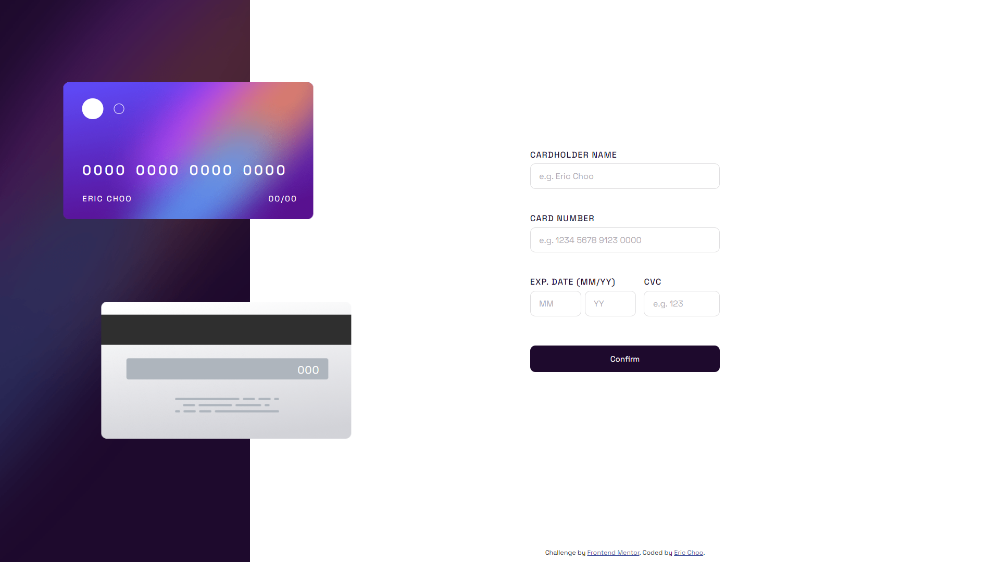
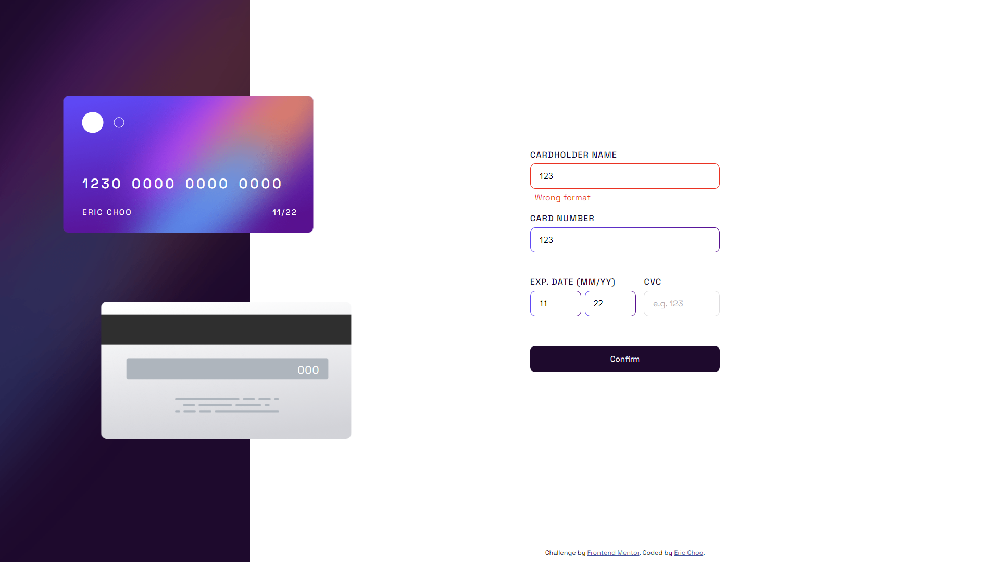
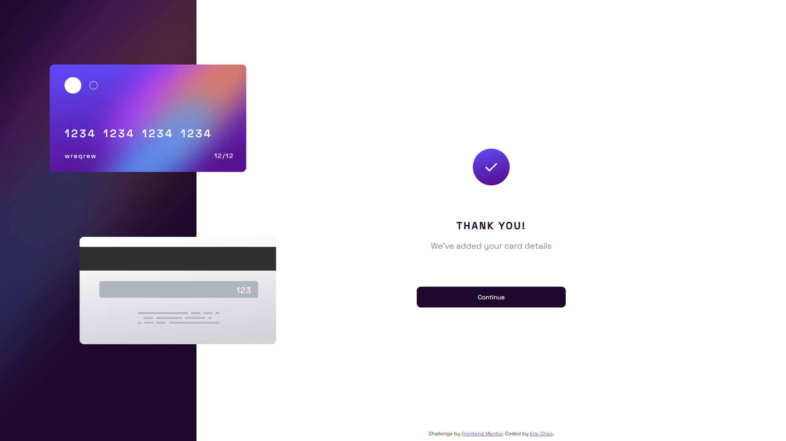
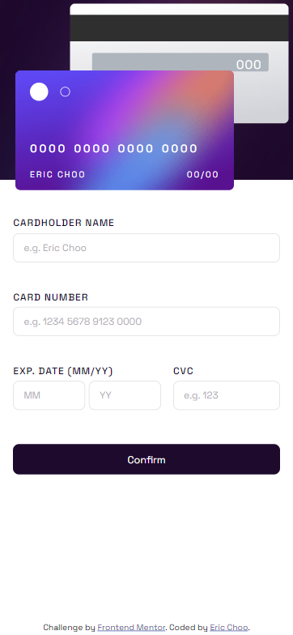
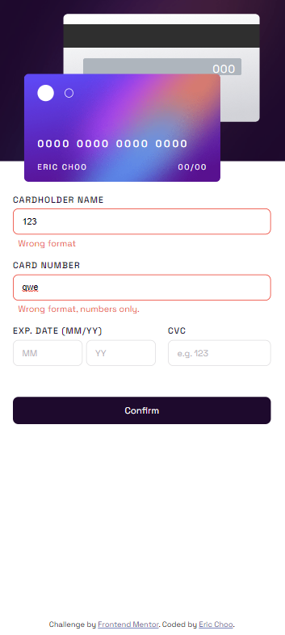
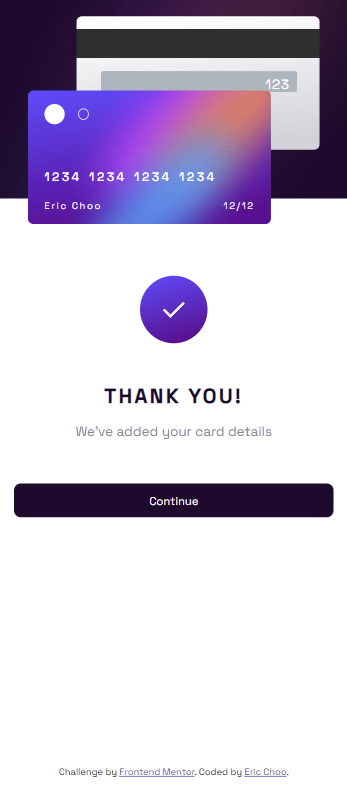

# Frontend Mentor - Interactive card details form solution

This is a solution to the [Interactive card details form challenge on Frontend Mentor](https://www.frontendmentor.io/challenges/interactive-card-details-form-XpS8cKZDWw). Frontend Mentor challenges help you improve your coding skills by building realistic projects. 

## Table of contents

- [Overview](#overview)
  - [The challenge](#the-challenge)
  - [Screenshot](#screenshot)
  - [Links](#links)
- [My process](#my-process)
  - [Built with](#built-with)
  - [What I learned](#what-i-learned)
  - [Continued development](#continued-development)
  - [Useful resources](#useful-resources)
- [Author](#author)

## Overview

### The challenge

Users should be able to:

- Fill in the form and see the card details update in real-time
- Receive error messages when the form is submitted if:
  - Any input field is empty
  - The card number, expiry date, or CVC fields are in the wrong format
- View the optimal layout depending on their device's screen size
- See hover, active, and focus states for interactive elements on the page

<br/>

### Screenshot

&nbsp;&nbsp;&nbsp;&nbsp;&nbsp; - Desktop View:
<p align="center">
  
</p>

&nbsp;&nbsp;&nbsp;&nbsp;&nbsp; - User can't submit form if no input:
<p align="center">
  
</p>

&nbsp;&nbsp;&nbsp;&nbsp;&nbsp; - Error shown when invalid input; Input fields remain active state if inputs are valid
<p align="center">
  
</p>

&nbsp;&nbsp;&nbsp;&nbsp;&nbsp; - Complete state
<p align="center">
  
</p>

&nbsp;&nbsp;&nbsp;&nbsp;&nbsp; -Mobile View
<p>
    &nbsp;&nbsp;&nbsp;
    &nbsp;&nbsp;&nbsp;
  
</p>

<br/>

### Links

- Solution URL: [Github](https://github.com/ericcst197/interactive-card-details-form)
- Live Site URL: [Live demo](https://ericcst197.github.io/interactive-card-details-form/)


## My process

Complete duration: 12 days (24 Aug 2022 - 4 Sept 2022). 


### Built with:

- HTML, CSS, Javascript
- CSS - BEM methodology
- SASS/SCSS
- Flexbox
- CSS Grid
- Desktop-first workflow
 

### What I learned:

 - Basics concept of CSS flexbox and CSS Grid
 - Form validation using Javascript
 - Styling CSS gradient border.
 ```css
    .form__input:active, 
    .form__input:focus {
      background: linear-gradient(#fff, #fff) padding-box,
      linear-gradient(to right,rgb(100, 72, 254), rgb(96, 5, 148)) border-box;
      border: 1px solid transparent;
      border-radius: .5rem;
    }
```


### Continued development

This project is built in responsively.

Some implementation can be added in future:

- Can implement some animation for the label when input is in active or focus state.
- Click the card to switch the position from the front and the back.


### Useful resources

- [Javascript Form Validation](https://www.javascripttutorial.net/javascript-dom/javascript-form-validation/#:~:text=What%20is%20form%20validation,is%20called%20client%2Dside%20validation.) - This helped me for designing the Javascript function after being struggled for sometimes. I really liked this pattern and will use it going forward.
- [Create a gradient border in CSS](https://nikitahl.com/gradient-border-css) - This is an article which helped me understand how to create a gradient border in CSS. I'd recommend it to anyone still learning this concept.


## Author

- GitHub - [Eric Choo](https://github.com/ericcst197)
- Frontend Mentor - [@ericcst197](https://www.frontendmentor.io/profile/ericcst197)

